**git指北**

**git介绍**

*Git
是一个开源的分布式版本控制系统，用于敏捷高效地处理任何或小或大的项目。如果你无法理解，你可以将它看成把文件保存在云端的搬运工，帮你把文件搬到云端服务器
eg：GitHub，coding，gitlab*

**安装git**

我们要求在Ubuntu系统中安装git，请先下载git。

> ***首先查看系统是否已经安装好git了***\
> git\
> ***若返回error等报错，翻译一下，如果没有安装git，接着下一步***\
> sudo apt-get update\
> sudo apt-get install git\
> ***安装好后重复第一步，检查是否安装完毕***

**git配置**

>  git config \--global user.name \"aaa\"
>  ***\"aaa"中的内容为你的英文名，随便***\
>  git config \--global user.email \"aa@qq.com\" ***换成你的邮箱***\
>  ssh-keygen -t rsa -C \"aa@qq.com\" ***同上,然后连按回车***

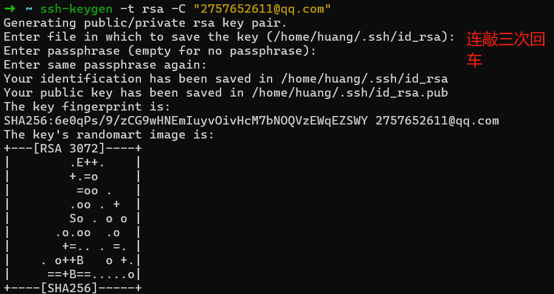

>  ***进入id_rsa.pub把公钥复制出来，是id_rsa.pub!!!不是id_rsa!!!***\
>  cd \~/.ssh\
>  gedit id_rsa.pub ***可能会报错没有gedit，可以用nano或者vim，或者下载gedit***\
>  ***如果是使用wsl的同学，请直接使用鼠标选中然后ctrl+shift+C即可复制（使用vim的话无法被windows检测到）***

  -----------------------------------------------------------------------------------------------------

将文件中的内容全部复制出来，打开GitHub，进入你的设置中添加公钥

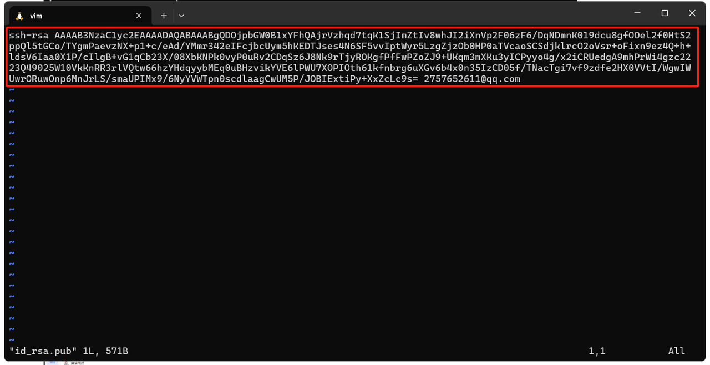

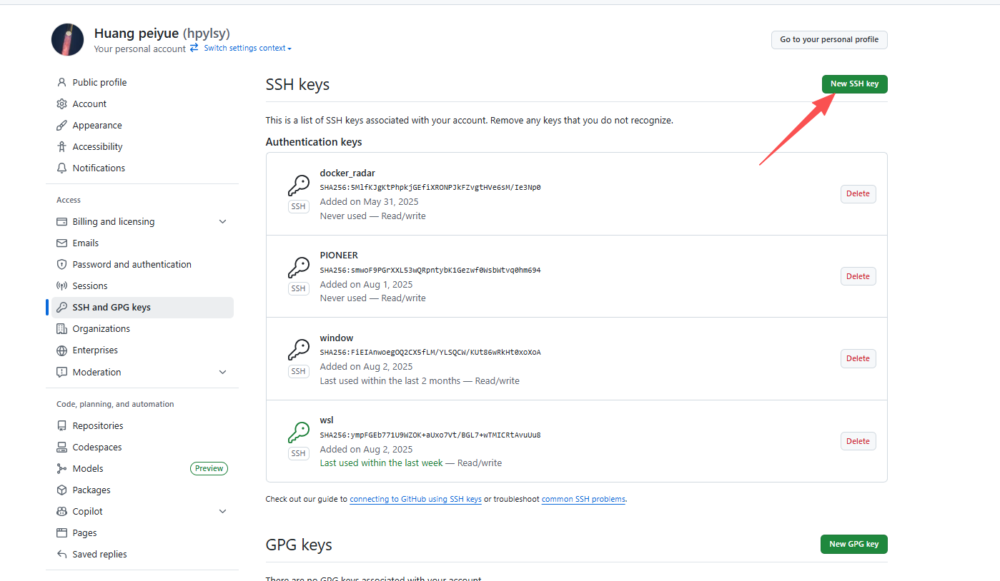

然后在终端中输入下列命令

>  ssh -T git@github.com\
> 
>  ***> Hi USERNAME! You\'ve successfully authenticated, but GitHub does***\
>  ***\>not provide shell access.***

**使用git**

> **先在GitHub中建立自己的仓库**
>
> 代码仓库-创建自己的代码仓库-快速初始化
>
> **将本地文件git到GitHub**
>
> 先创建一个文件夹，用终端打开对本地仓库进行初始化

  -----------------------------------------------------------------------
  >git init ***进行初始化仓库***
  -----------------------------------------------------------------------

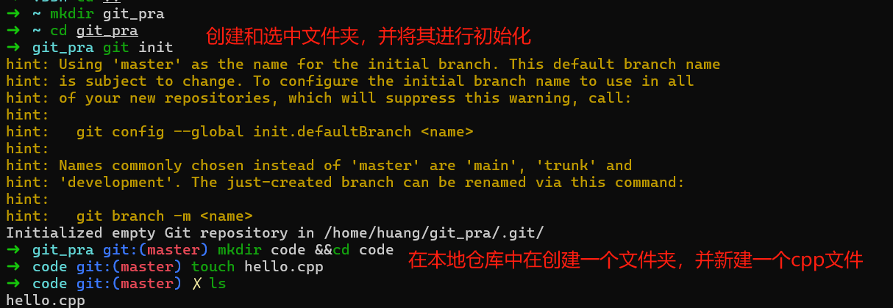

将本地仓库与远端服务器相连接

>  git remote add origin \<server\>
>  ***\<server\>用代码仓库中的ssh链接进行代替***\
>  git config \--global credential.helper store
>  ***配置密码存储，不用每次上传都重新输账号密码，注意是否有error报错***\
>  ***提示输入账号密码时***\
>  ***账号为注册GitHub的邮箱，密码是GitHub的密码***

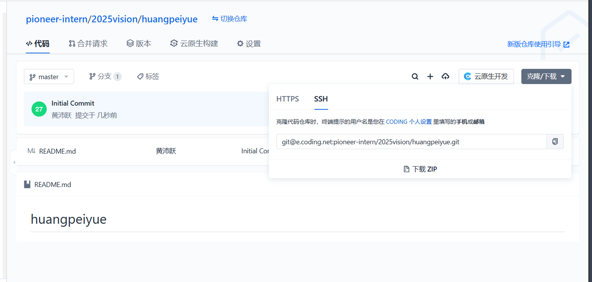

你的本地仓库由 git 维护的三棵"树"组成。第一个是你的
工作目录，它持有实际文件；第二个是
暂存区（Index），它像个缓存区域，临时保存你的改动；最后是
HEAD，它指向你最后一次提交的结果。

现在将文件传上云端分三步

> 1、添加到暂存区
>
> 2、对上传行为进行备注
>
> 3、送上云端

 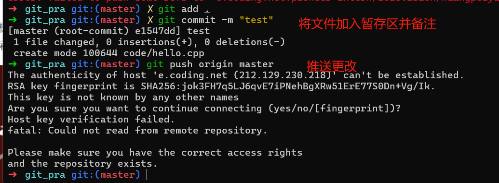

> 可以看到，上图有fatal，证明是有错误，报错显示无法读取远程服务器，也就是无法与GitHub连接，一般是上面的步骤做错了，重做一遍就是。
>
> 没问题继续往下
>
 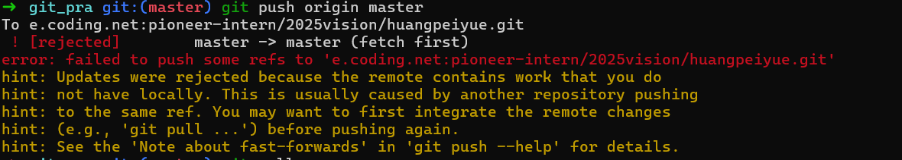
>
> 发现又有新问题，翻译可得：本地分支落后于远程分支，因此推送被拒绝了，换句话说，远程分支已经更新，而您的本地分支未同步这些更新。

  ***解决方法***\
  ***拉取远程分支***\
  git pull origin master\
  ***对于这个问题csdn会推荐使用强制推送，但是这样治标不治本，还会导致更改记录丢失，所以极不推荐！***\
  git push -f origin master ***强制推送，不推荐！***

 在这里可能又会出现报错

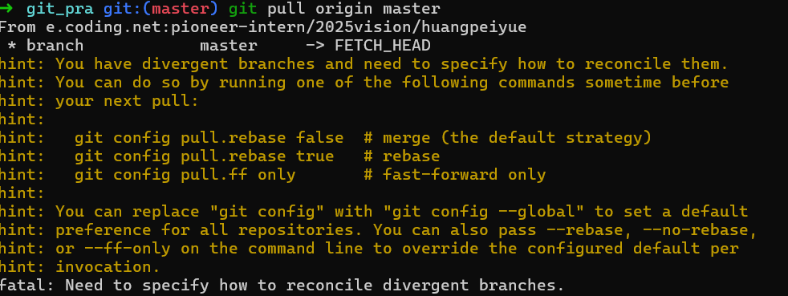

信息表明：表明本地分支与远程分支发生了分歧，这意味着它们有不同的提交历史。需要明确如何处理这些分歧。在这种情况下，您有几个选项可以选择合并远程更改。

  ***使用合并（推荐）***\
  git pull \--no-rebase origin master\
  ***使用变基（可能会对别人产生印象，因为它会删除一下历史记录）***\
  git pull \--rebase origin master\
  ***使用快进合并***\
  git pull \--ff-only origin master

使用合并后，再进行一次pull即可，此时没有报错，如下，最后进行push，成功上传，去GitHub可以看到自己上传的文件了。

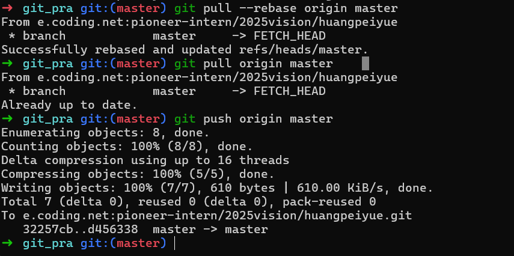

**把云端文件git到本地仓库**

使用git clone可以直接把仓库中所有文件都克隆下来

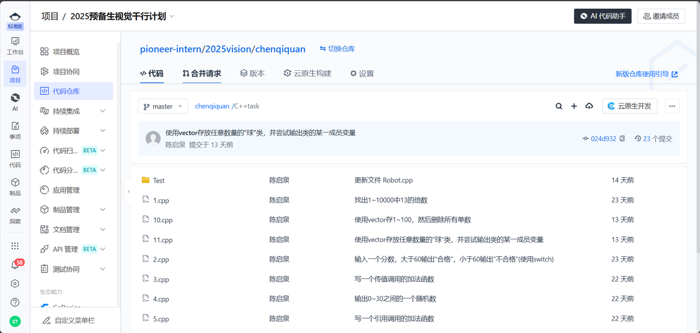

**提交暑假任务**

首先可以连接到仓库

  git remote add origin \<remote server\>\
  ***步骤 2：创建特性分支***\
  git checkout -b 分支名（一般为姓名拼音，eg：HuangPeiyue）\
  
  ***在当前文件夹下创建同名文件夹，并在下面完成任务***\
  ***eg：路径为：./HuangPeiyue/task1/HelloWorld.cpp***\
  
  ***提交任务文件夹***\
  git add HuangPeiyue/\
  
  ***提交说明***\
  git commit -m \"\<commit\>\"\
  
  ***类型前缀：***\
  ***feat: - 新功能/算法实现***\
  ***fix: - bug修复***\
  ***docs: - 文档更新***\
  ***refactor: - 代码重构***\
  
  ***假如我完成了任务1.1***\
  git commit -m \"feat: Finish task1.1\"\
  git push origin HuangPeiyue\
  
  ***这样就完成了上传任务代码，创建分支不需要每次都创建***\
  ***有问题及时在群里提出***

**Pull Request**

提交完代码后，应该能在GitHub查看到改变，这时候需要提交Pull
Request来让管理员整合你的代码到主分支中

访问GitHub仓库页面

点击 \"Compare & pull request\"

填写PR描述：模板如下

点击 \"Create pull request\"

  -----------------------------------------------------------------------
  \## 算法实现说明\
  \
  \### 实现功能\
  \- \[ \]\
  \- \[ \]\
  \
  \### 特别说明

  -----------------------------------------------------------------------

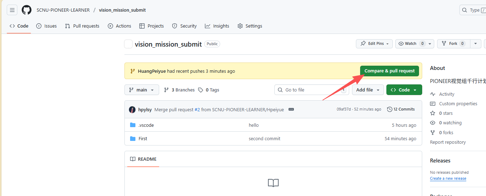

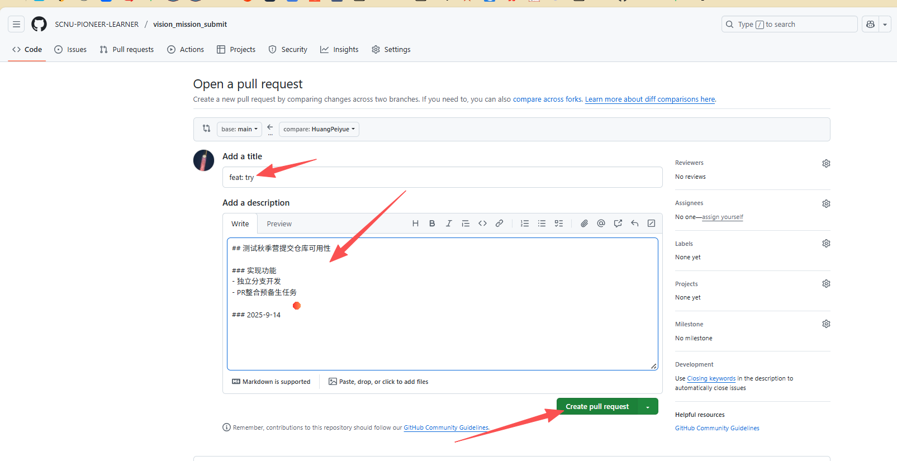

